# Chinese Style Metrics (Spring Festival MVP)

这是一个春节主题的 GitHub Commit 可视化原型：
- 保持 GitHub Contributions Calendar 的周/星期网格结构。
- 使用等距 3D 方块渲染每日贡献强度（lowlighter 风格）。
- 输出 SVG，适合 README 长期展示与缩放。
- 春节窗口（除夕到元宵）使用红金强调并叠加轻量节庆元素。

## 当前图像



## 本地运行（Node + TypeScript）

```bash
npm ci
npm run generate -- --username Fengzdadi --year 2026 --duration full-year
```

## 自动更新

仓库内置 GitHub Actions：`/Users/wanderer/Project/LongTerm/Personal/Chinese-Style-Metrics/.github/workflows/update-cny-metrics.yml`，默认每天更新一次 SVG。

## 下一步

1. 增加 `--theme` 参数（`minimal-cny` / `festive-cny` / `ink-cny`）。
2. 引入 24 节气刻度层（保持同一网格骨架）。
3. 输出同时生成 `svg + png`（社媒分享更方便）。
